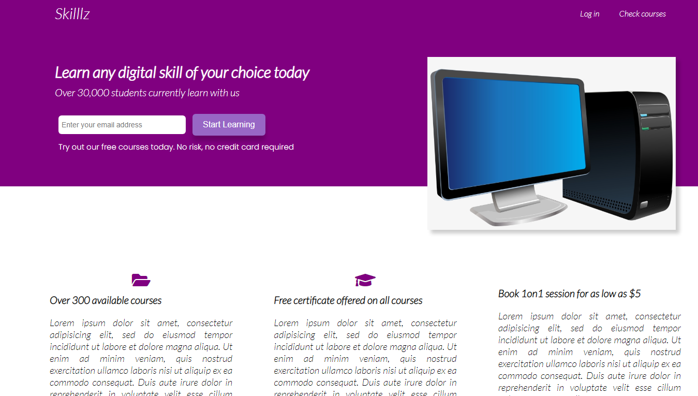
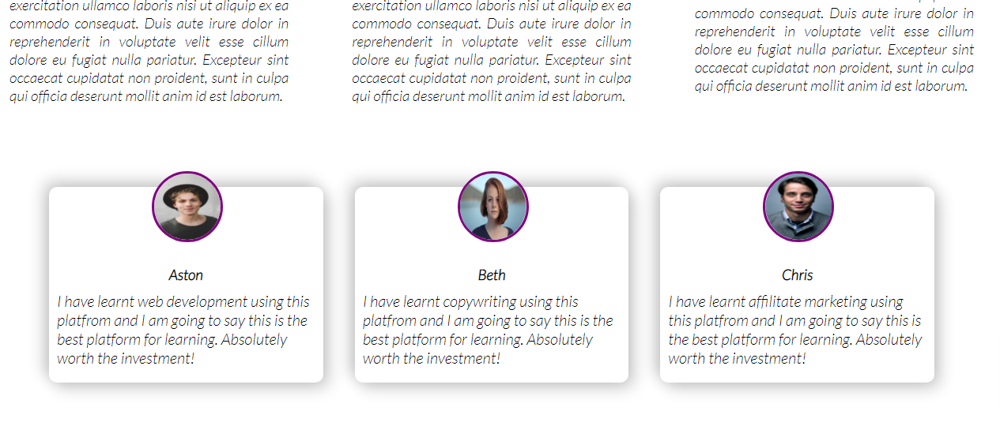
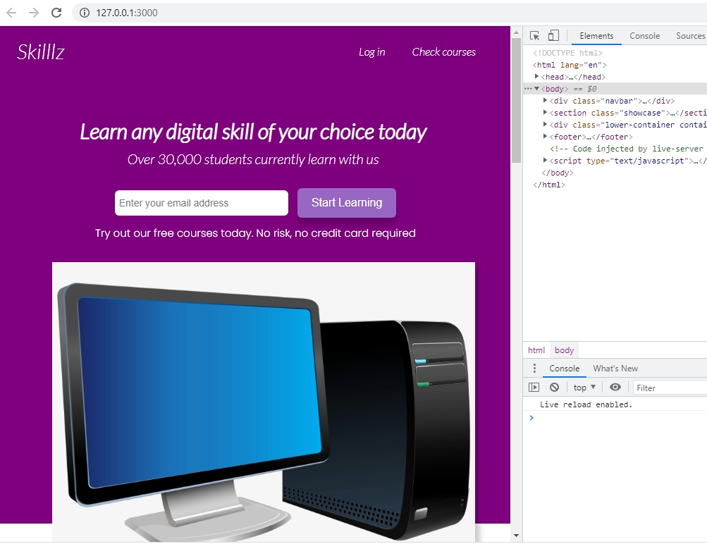
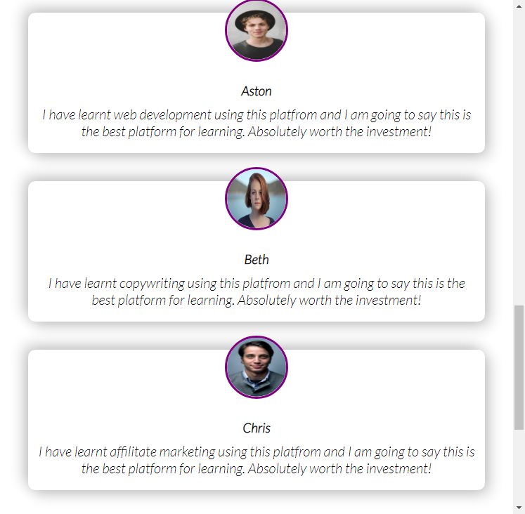
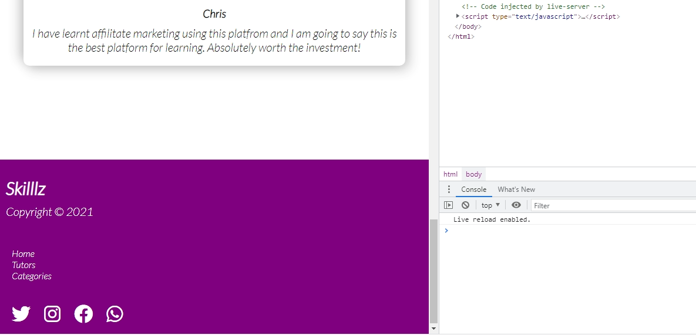
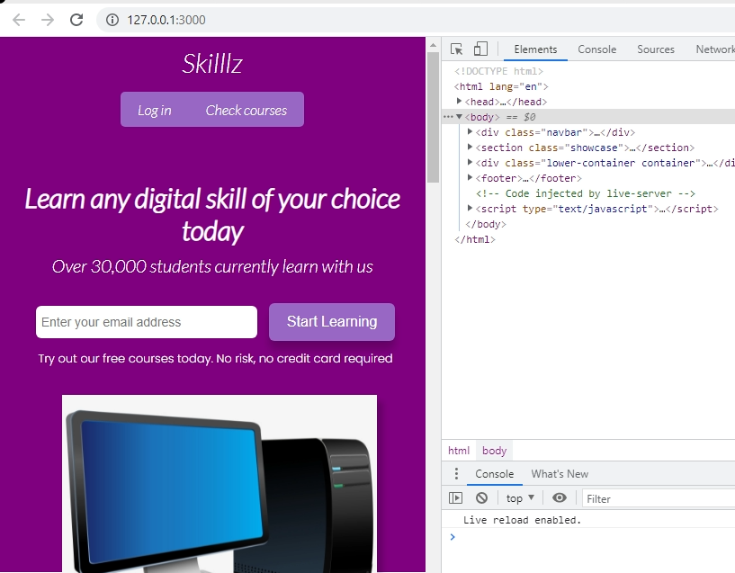
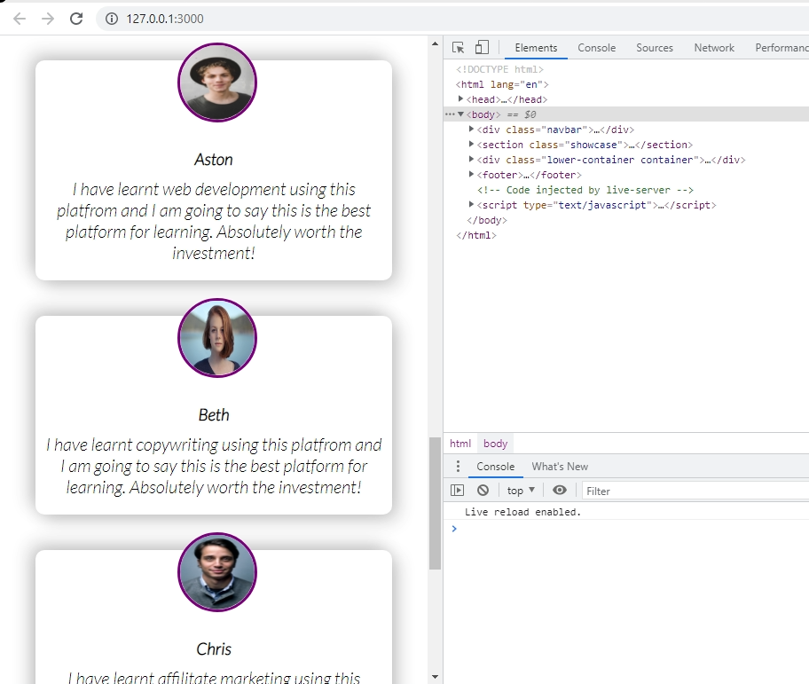

## In gute Spanish

*************************************************************
## Una elegante página de aterrizaje "Landing Page" de color púrpura.
Para llegar a la siguiente página, utilice **Sass scss**. Cuando se trata de "mobile first", los iconos se encuentran en [Font Awesome Icons] (95).

Los iconos se encuentran en: [Font Awesome Icons](https://fontawesome.com/v4.7/icons/).

## IMÁGENES.

1.- Imagen de Skilllz uno: 
***
2.- Imagen Skilllz dos:    
***
3.- Imagen de footer: 

### RESPONSIVE (TABLETS)

Para tabletas debe quedar:

***

***

### RESPONSIVE (PANTALLAS MÓVILES)
En dispositivos móviles con pantallas más pequeñas.

***

***

***************************************************************************************
## A Sleek Purple Landing Page
Baut die folgende Seite nach, verwendet scss. Wen ihr anfangt denkt an "mobile first"

Die Icons findet ihr bei [Font Awesome Icons](https://fontawesome.com/v4.7/icons/).

## SCREENSHOTS

***

***

### RESPONSIVE (TABLETS)

***

***

### RESPONSIVE (MOBILE SCREENS)
On mobile devices with smaller screens.

***

***

